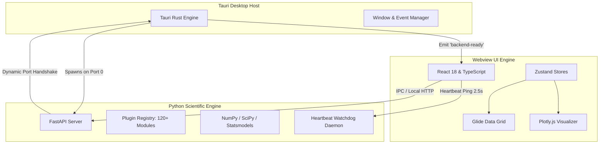

# System Architecture

LibRE Tab is designed as a hybrid desktop platform combining a native Rust shell, a React user interface, and an asynchronous Python scientific engine.



---

## 1. Desktop Shell (Rust & Tauri)

The desktop binary is compiled using **Tauri v1** (Rust):

- **Window Management**: Configures native application windows, resizable borders, min/max dimensions, and context menus.
- **Sidecar Lifecycle Manager**:
  - Automatically locates and launches the Python engine process on startup.
  - In development mode, executes `python backend_entry.py --port 0`.
  - In production packaged mode, launches the compiled binary (`libretab-server.exe`).
- **Clean Exit Termination**: Catches `WindowEvent::Destroyed` and sends an immediate termination signal (`child.kill()`) to the sidecar process to prevent background leaks.

---

## 2. Dynamic Ephemeral Port Handshake

To prevent port collision issues with other local services or instances:

1. The Python engine binds to port `0`, prompting the OS kernel to assign an available ephemeral port.
2. The engine outputs a JSON handshake line to standard output:
   ```json
   {"status": "ready", "port": 52580}
   ```
3. Tauri's output reader thread intercepts the handshake and saves the port in an `Arc<Mutex<Option<u16>>>`.
4. Tauri emits a `backend-ready` event directly to the Webview window.
5. The frontend `api.ts` service receives the port and routes all subsequent analysis requests to `http://127.0.0.1:52580/api/v1`.

---

## 3. Frontend Architecture

The user interface is built with **React 18** and **TypeScript**:

- **Grid Rendering**: Powered by `@glideapps/glide-data-grid`, capable of rendering hundreds of thousands of cells at 60 FPS using an HTML5 Canvas virtualized renderer.
- **State Management**: Zustand stores manage application state:
  - `useWorksheetStore`: Handles multi-sheet arrays, columns, cells, formulas, undo/redo history stacks, and `isDirty` state tracking.
  - `useSessionStore`: Manages analysis session outputs, Markdown transcripts, and Plotly figure schemas.
  - `usePluginStore`: Manages dynamic plugin discovery, menu hierarchy trees, and compute execution.
  - `useUnsavedPromptStore`: Coordinates the Save / Don't Save / Cancel confirmation modal.
- **Design Tokens**: Styled using Tailwind CSS and Microsoft Fluent UI components for an enterprise look and feel.

---

## 4. Analytical Computing Engine

The statistical engine runs on **FastAPI** with optimized serialization:

- **Vectorized Scientific Computing**: Calculations use NumPy, SciPy, Statsmodels, Scikit-Learn, and Lifelines.
- **Fast Serialization**: Utilizes `orjson` with custom serializers (`FastORJSONResponse`) that recursively convert NumPy data types (`float64`, `int64`, `ndarray`, `NaN`, `Inf`) into standard JSON primitives.
- **Heartbeat Watchdog Daemon**: A background thread checks for incoming heartbeat pings (`/heartbeat`) every 2.5 seconds. If no heartbeat is received within the timeout window (e.g. if the parent application is killed via Task Manager), the Python process cleanly terminates itself (`os._exit(0)`).
