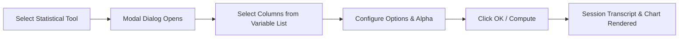

# How to Use LibRE Tab

This guide covers the core workflow of LibRE Tab: managing multi-sheet workbooks, importing data, running statistical analyses, interacting with output charts, and generating reports.

---

## 1. Workspace Layout

The LibRE Tab interface is organized into five primary regions:

```
+-------------------------------------------------------------------------+
| Top Menu & Ribbon Toolbar (File, Edit, Data, Calc, Stat, Graph, Help)    |
+-------------------+-----------------------------------------------------+
|                   | Upper Pane: Session Output Transcript & Plotly View |
| Left Navigator    | (Statistical results, ANOVA tables, charts)         |
| Sidebar           +-----------------------------------------------------+
| (Worksheets &     | Resizable Divider Bar                               |
| Session history)  +-----------------------------------------------------+
|                   | Lower Pane: Dynamic Formula Bar & Worksheet Grid    |
|                   | (Multi-sheet tabs: Sheet 1, Sheet 2, ...)           |
+-------------------+-----------------------------------------------------+
| Status Bar (Active sheet name, row/column counts, selection metrics)    |
+-------------------------------------------------------------------------+
```

1. **Top Menu & Ribbon**: Quick access to statistical procedures, DOE modals, file operations, and data manipulation tools.
2. **Left Navigator**: Tree explorer displaying active sheets, DOE matrices, and history of statistical output sessions.
3. **Session Output Pane**: Dedicated transcript area displaying Markdown text summaries, structured statistical tables, $p$-values, test statistics, and interactive Plotly figures.
4. **Formula Bar & Worksheet Grid**: High-performance dual-header spreadsheet with dynamic $C_1, C_2, \dots, C_n$ column indices, named variables, data types (Numeric, Text, Date), and formula evaluation.
5. **Status Bar**: Real-time summary information, active worksheet dimensions, and computed statistics for the active selection.

---

## 2. Importing & Managing Data

=== "Open / Import Files"
    LibRE Tab supports native project files, Excel spreadsheets, and delimited text:

    - **Native Project (`.ltb`)**: `Ctrl+O` or `File > Open Project / Data`. Restores complete project state, multiple sheets, column metadata, and session history.
    - **Excel (`.xlsx`, `.xls`)**: `Ctrl+I` or `File > Import Excel Workbook`. Automatically imports all sheets in the workbook.
    - **CSV / TSV / TXT**: `File > Import CSV / Text Data` or drag and drop any `.csv` file onto the application window.

=== "Manual Data Entry & Formulas"
    - **Dual-Header Editing**: Double-click any column header to rename the variable. Type indicator labels (`-T` for Text, `-D` for Date) update automatically based on entered data.
    - **Formula Execution**: Select a target column, click the **Formula Bar**, and enter expressions like `C1 * 1.5`, `LN(C2)`, `STANDARDIZE(C3)`, or `C2 - C1`. Formulas evaluate automatically across all rows.
    - **Patterned Data Generation**: Navigate to `Data > Create Patterned Data` to populate numeric sequences (e.g. `1 to 50 by 2`) or categorical factor levels (`A, B, C` repeated $N$ times).

=== "Data Manipulation Suite"
    - **Sort Columns**: `Data > Sort Columns` allows multi-key sorting with ascending/descending criteria.
    - **Stack / Unstack**: `Data > Stack Columns` reshapes wide columns into tall subscripted pairs; `Data > Unstack Columns` reverses the transformation.
    - **Recode**: `Data > Recode Data` maps categorical text or bins numeric continuous ranges into new discrete categories.
    - **Subset Worksheet**: `Data > Subset Worksheet` filters rows based on conditional expressions (e.g. `Batch == "A" & Temperature > 80`) into a new sheet.

---

## 3. Running a Statistical Analysis

To perform any statistical test or quality calculation:



1. **Select the Procedure**: Click from the **Stat**, **Graph**, or **DOE** top menus, or press <kbd>Ctrl</kbd> + <kbd>K</kbd> to open the **Universal Command Palette** and search by name.
2. **Assign Columns**:
   - In the modal dialog, select a parameter field (e.g. *Response Variable* or *Sample Column*).
   - Double-click a column in the left list or click the **Select** arrow button.
3. **Configure Analytical Parameters**: Set the confidence level (e.g. `0.95`), hypothesis test values, alternative hypothesis direction ($\neq, <, >$), or distribution type.
4. **Compute**: Click **OK**. The Python engine computes the analytical model, and the results appear in the **Session Output Pane**.

---

## 4. Interactive Charts & Plotly Visualizations

All graphs generated by LibRE Tab (Histograms, Capability Sixpack, Control Charts, Residual Plots, Surface Plots) are rendered with **Plotly.js**:

- **Zoom**: Click and drag a bounding box on any chart region.
- **Pan**: Click and drag while holding <kbd>Shift</kbd>.
- **Hover Tooltips**: Move your cursor over points, violation marks, or density curves to view exact coordinates, observation numbers, and test failure rules.
- **Export Chart**: Click the camera icon in the upper-right corner of any plot to export high-resolution PNG or SVG vector graphics.

---

## 5. Design of Experiments (DOE)

LibRE Tab includes dedicated experiment design generators:

=== "Taguchi Methods"
    1. Navigate to `DOE > Taguchi > Create Taguchi Design`.
    2. Choose number of factors (2 to 31) and levels (2-Level or 3-Level).
    3. Select an orthogonal array ($L_4, L_8, L_9, L_{12}, L_{16}, L_{18}, L_{27}$).
    4. Click **OK** — a randomized worksheet is generated with run orders and experimental factor levels.
    5. After recording responses, run `DOE > Taguchi > Analyze Taguchi Design` to generate S/N ratio response tables, delta rankings, and main effects plots.

=== "Factorial & Response Surface (RSM)"
    1. Navigate to `DOE > Factorial > Create Factorial Design` or `DOE > Response Surface > Create RSM Design`.
    2. Select Full Factorial ($2^k$), Fractional Factorial ($2^{k-p}$), Central Composite (CCD), or Box-Behnken designs.
    3. Specify factor names, low/high continuous levels, and replicates.
    4. Analyze the design with `DOE > Analyze Factorial Design` to generate ANOVA tables, Pareto charts of standardized effects, and 3D surface/contour plots.

---

## 6. Saving, Printing & Exporting

- **Save Project (`Ctrl+S`)**: Saves all open worksheets, column formulas, metadata, and generated session results into a native `.ltb` file.
- **Unsaved Changes Guard**: If you have unsaved changes, LibRE Tab prompts you with **Save / Don't Save / Cancel** before creating a new project, opening another file, or exiting.
- **Export Excel (`Ctrl+E`)**: Exports all worksheets to a multi-sheet Microsoft Excel (`.xlsx`) workbook.
- **Print / PDF Report (`Ctrl+P`)**: Generates a high-resolution print report of the active worksheet and analysis session.

---

## 7. Keyboard Shortcuts Reference

| Shortcut | Action |
| :--- | :--- |
| <kbd>Ctrl</kbd> + <kbd>K</kbd> | Open Universal Command Palette |
| <kbd>Ctrl</kbd> + <kbd>N</kbd> | New Project (Guarded) |
| <kbd>Ctrl</kbd> + <kbd>O</kbd> | Open Project or Data File (`.ltb`, `.xlsx`, `.csv`) |
| <kbd>Ctrl</kbd> + <kbd>S</kbd> | Save Project (`.ltb`) |
| <kbd>Ctrl</kbd> + <kbd>Shift</kbd> + <kbd>S</kbd> | Save Project As (`.ltb`) |
| <kbd>Ctrl</kbd> + <kbd>I</kbd> | Import Excel Workbook (`.xlsx`) |
| <kbd>Ctrl</kbd> + <kbd>E</kbd> | Export Excel Workbook (`.xlsx`) |
| <kbd>Ctrl</kbd> + <kbd>P</kbd> | Print / Export PDF Worksheet Report |
| <kbd>Ctrl</kbd> + <kbd>Z</kbd> | Undo last worksheet edit |
| <kbd>Ctrl</kbd> + <kbd>Y</kbd> / <kbd>Ctrl</kbd> + <kbd>Shift</kbd> + <kbd>Z</kbd> | Redo worksheet edit |
| <kbd>Ctrl</kbd> + <kbd>C</kbd> | Copy selected grid cells |
| <kbd>Ctrl</kbd> + <kbd>X</kbd> | Cut selected grid cells |
| <kbd>Ctrl</kbd> + <kbd>V</kbd> | Paste cells from clipboard |
| <kbd>Delete</kbd> | Clear selected cell values |
